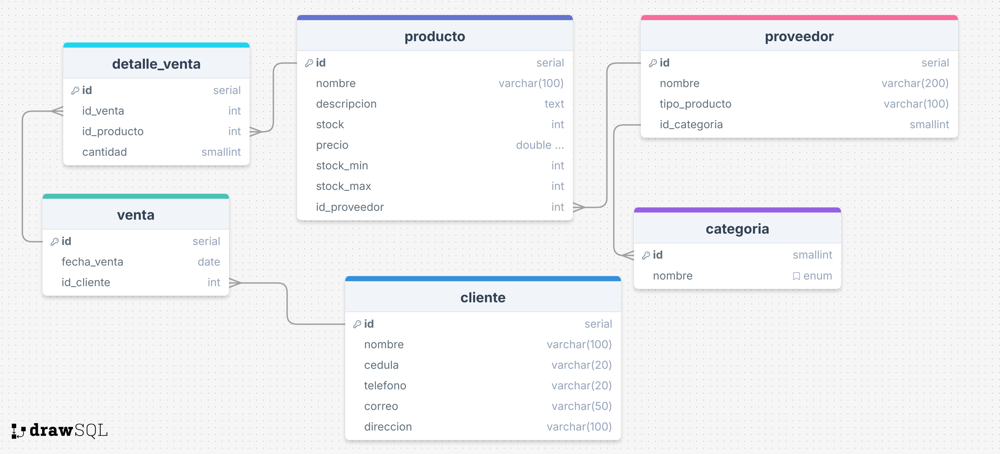

# filtro_postgresql_RojasWilmer

<h1>Descripcion</h1> 

Este proyecto consiste en el desarrollo de una base de datos para gestionar un sistema de ventas. Suproposito principal es facilitar el registro y control de las ventas y compras a proveedores, que incluye: 

* Tabla de cliente con sus datos personales
* Tabla producto con los datos del producto stock, stock minimo y maximo, precio y nombre del producto
* Tabla Venta
* Tabla detalle_venta
* Tabla categoria para enumerar las categorias vendidas en la tienda
* Tabla proveedor
* Gestion de proveedores y categoria de los productos
* Registro de ventas y detale de cada una
* Consultas de los products mas vendidos

  
