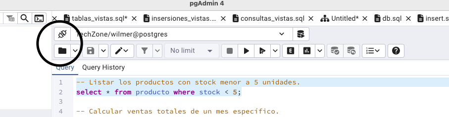
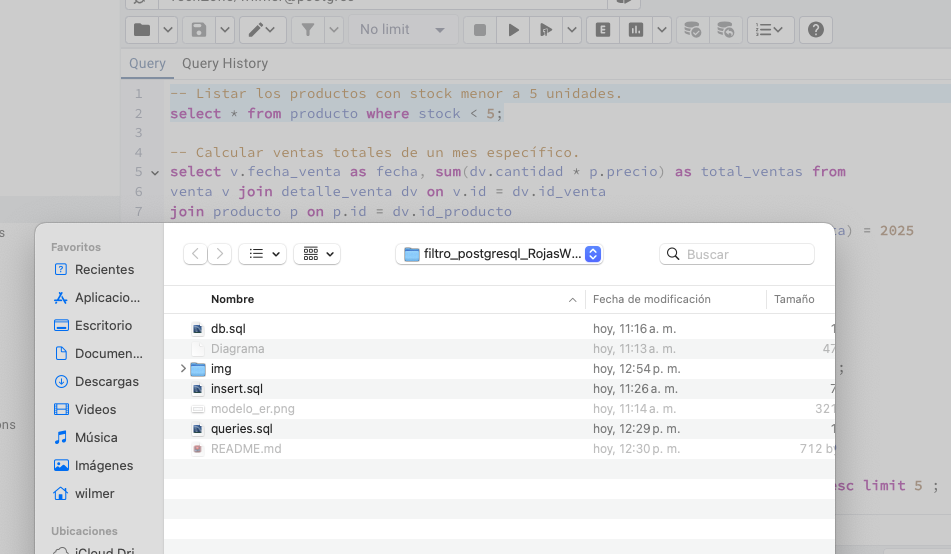
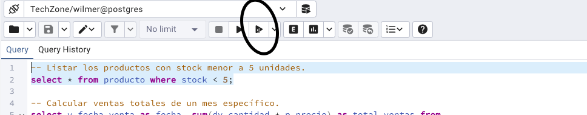

# filtro_postgresql_RojasWilmer

<h1>Descripcion</h1> 

Este proyecto consiste en el desarrollo de una base de datos para gestionar un sistema de ventas. Suproposito principal es facilitar el registro y control de las ventas y compras a proveedores, que incluye: 

* Tabla de cliente con sus datos personales
* Tabla producto con los datos del producto stock, stock minimo y maximo, precio y nombre del producto
* Tabla Venta
* Tabla detalle_venta
* Tabla categoria para enumerar las categorias vendidas en la tienda
* Tabla proveedor
* Gestion de proveedores y categoria de los productos
* Registro de ventas y detale de cada una
* Consultas de los products mas vendidos

  

  <h2>Instcciones de como ejecutar archivos .sql en postgreSQL</h2>

  * Tener PostgreSQL y/o pgAdmin instalados.
  * Disponer de una base de datos creada.
  * buscar los archivos .sql suministrados en el repositorio.
  * Abrir pgAdmin
  * seleccionar la carpeta 
  * seelcionar el archivo db.sql 

  <h2>Descripcion de scrips</h2>

  * modelo_er.png Muesta el diagrama ER de la base de datos.
  * db.sql muesta las tablas de la base de datos.
  * insert.sql muestra las insersiones de datos para las tablas.
  * queries.sql muestra las consultas hechas a las tablas.
 

<h2>Ejemplo de consultas</h2>
    -- Listar los productos con stock menor a 5 unidades.
select * from producto where stock < 5;
 para ejecutar la consulta deseada.

seleccionas la consulta para ejecutar y presionas 
para ejecutar la consulta requerida.

